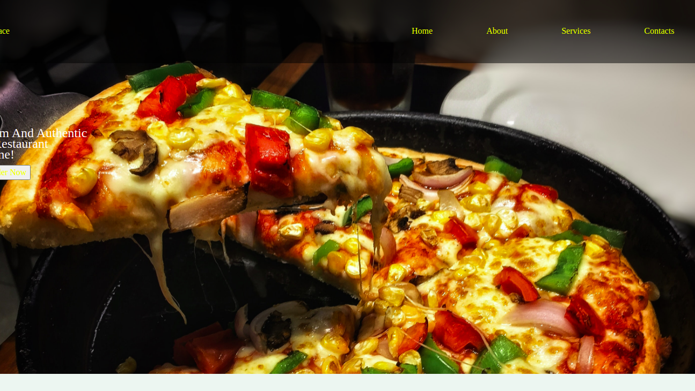

# Pizza pap!
[Check it out](https://mel-001.github.io/Pizza-Place/)

## Description: 
A pizza ordering web application.

## Author:
> Melonie Langat

## Screenshot:

## Setup:
`git clone https://github.com/Mel-001/Pizza Place.git` or download the zip file

Extract the zip file

`cd` project folder

`launch` the index.html file

## Technologies:
* HTML5
* CSS3
* Bootstrap
* Javascript
* Jquery

## BDD:
| Inputs |  Description |
| :---         |          ---: |
| Pizza Flavour   | `eg chicken-tikka`|
| Pizza size     | `eg medium`   |
| Pizza crust    | `eg flatbread crust`   |
| Pizza topping    | `eg Beef peperoni`  |
| Number of pizzas   | `eg 4`   |
| Delivery mode   | `eg No delivery`   |

## License:
>MIT LICENSE &copy; 2022 Melonie

## Collaborate:
To contribute to Pizza pap!, reach me on `melonielangat@gmail.com`.